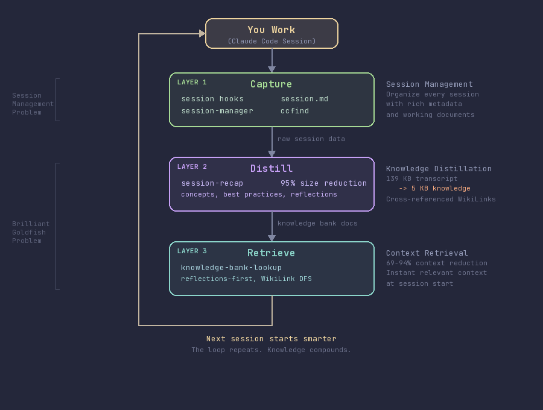
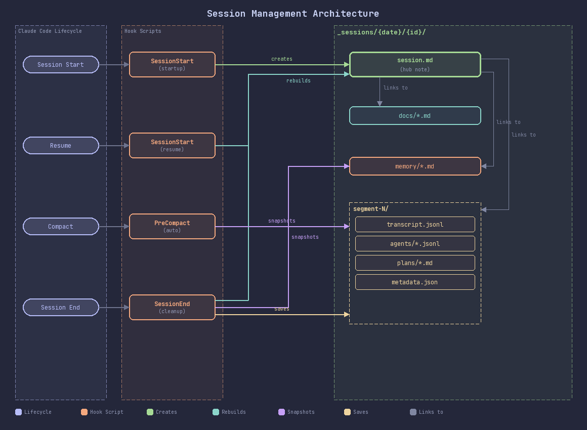
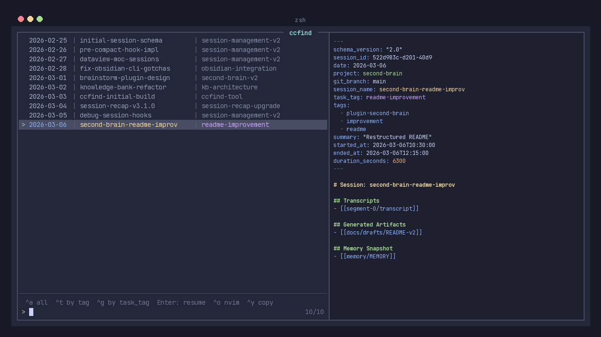
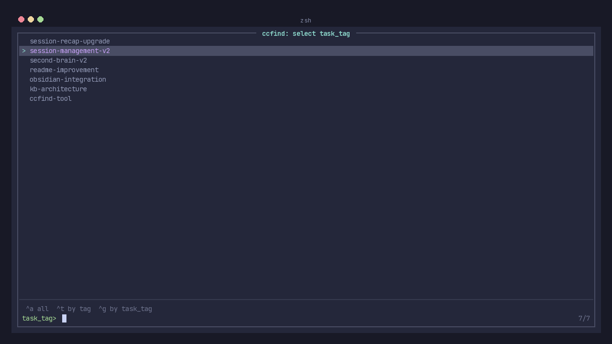
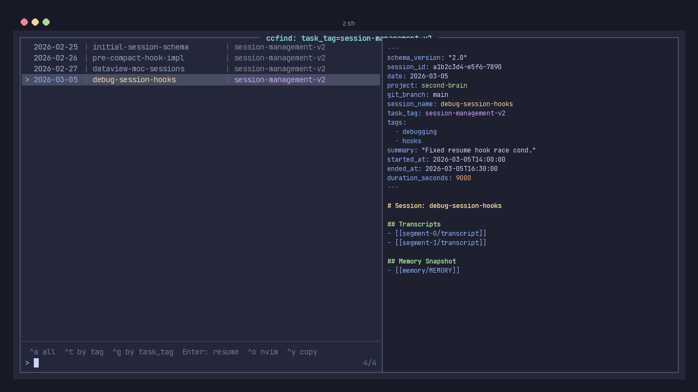
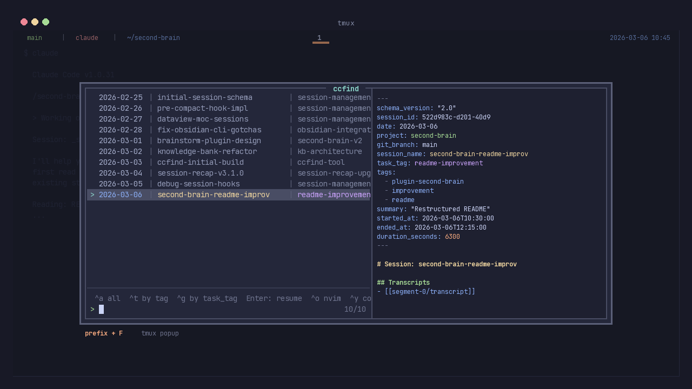

<div align="center">
  

  # Second Brain

  
  
  
  
</div>

> **Give your AI a memory it deserves.**

Transform Claude from a brilliant goldfish into an elephant—with persistent knowledge, organized sessions, and compound learning across every conversation.

---

## Two Problems, One Plugin

### Problem 1: The Claude Code Session Management Problem

Claude Code sessions are a black hole. Work goes in, nothing comes out.

- **No organization**: Sessions pile up with no way to tag, group, or categorize related work
- **No discoverability**: "What did I work on last Tuesday?" requires scrolling through a flat list of cryptic session IDs
- **No continuity**: Design docs, implementation plans, and specs generated during sessions scatter across repos with no connection to the conversation that produced them
- **No metadata**: No duration, no summary, no connection between sessions that tackled the same task

You're generating hours of valuable engineering work every day—and losing it all to an unstructured void.

### Problem 2: The "Brilliant Goldfish" Problem

Your AI is a genius with no long-term memory.

- **The Amnesia Loop**: Claude forgets your architecture, decisions, and history the moment the session ends—forcing you to re-explain context every single time
- **The Productivity Tax**: Each new session starts from absolute zero. The pattern you discovered last week? Gone. The gotcha you debugged yesterday? Forgotten
- **No Learning**: Claude can't learn lessons across sessions, making you demonstrate the correct approach over and over

Every new session is like working with a brilliant goldfish—amazing capabilities, but zero memory of what you taught it yesterday.

### How They Connect

These problems feed each other. Without session management, there's nothing to learn from. Without memory, organized sessions sit unused. **Second Brain solves both—and connects them into a continuous learning loop.**

---

## The Solution: An Agentic Workflow

<div align="center">
  
</div>

Second Brain works in three layers, each building on the last:

| Layer | What It Does | Components |
|-------|-------------|------------|
| **1. Capture** | Automatically organizes every session with rich metadata | Session hooks, `session.md`, `session-manager` |
| **2. Distill** | Transforms raw session data into actionable knowledge | `session-recap` |
| **3. Retrieve** | Surfaces relevant knowledge at the start of every new session | `knowledge-bank-lookup` |

**The loop**: You work → sessions are captured → knowledge is distilled → future sessions start smarter → you work better → repeat.

---

## Layer 1: Session Management

The foundation. Hooks into Claude Code's lifecycle to automatically capture, organize, and make sessions discoverable.

### How It Works

<div align="center">
  
</div>

**Lifecycle Hooks:**
- **SessionStart** — Creates a `session.md` hub note with frontmatter metadata via atomic filesystem write. Injects the session docs path into Claude's context so working documents land in the right place
- **SessionResume** — Re-injects context when resuming a session
- **PreCompact** — Records compaction boundary (line count + timestamp) before context summarization
- **SessionEnd** — Records duration, session name, transcript source path, and auto-memory snapshot. Rebuilds `session.md` as a hub note linking to all artifacts

**What Gets Captured:**

```
_sessions/2026-03-06/{session-id}/
├── session.md              # Hub note: metadata + references to everything
├── docs/                   # Working documents (designs, plans, reviews, issues)
├── memory/                 # Auto-memory snapshot at session end
└── compaction-points.txt   # Segment boundaries (line counts + timestamps)
```

### Working Documents — No More Scattered Artifacts

Skills that follow Prompt-Driven Development — like [superpowers](https://github.com/obra/superpowers)' `brainstorming` and `writing-plans` — generate design docs, implementation plans, and specs. Without Second Brain, these land in each repo's `docs/plans/` and scatter across your workspace:

```
repo-a/docs/plans/2026-03-06-auth-redesign-design.md
repo-b/docs/plans/2026-03-05-caching-layer-plan.md
repo-c/docs/plans/2026-03-04-api-migration-design.md
```

With Second Brain, the SessionStart hook injects the session docs path into Claude's context. Any skill that writes working documents automatically lands them in the session folder:

```
_sessions/2026-03-06/{session-id}/docs/
├── 2026-03-06-auth-redesign-design.md
└── 2026-03-06-auth-redesign-plan.md
```

Every artifact is linked from `session.md`, searchable via `ccfind`, and traceable back to the session that created it.

### `session-manager` — Tag and Organize Sessions

Tag sessions while you work—no extra steps after the fact.

```
/session-manager
```

| Property | Purpose | Example |
|----------|---------|---------|
| `task_tag` | Group sessions working on the same task | `refactor-auth`, `debug-caching` |
| `tags` | Freeform categorization | `brainstorming`, `debugging`, `architecture` |
| `summary` | One-line description | "Designed new auth flow for v2" |

### `ccfind` — Find and Resume Any Session

Think [sesh](https://github.com/joshmedeski/sesh) for tmux sessions, but for Claude Code sessions. A shell + fzf tool that makes your AI sessions searchable, browsable, and instantly resumable.

<div align="center">
  
  <p><em>ccfind in a standalone terminal — fuzzy search across all sessions with live preview</em></p>
</div>

<div align="center">

<video src="https://github.com/user-attachments/assets/29b0e0d2-efef-4541-b18c-c950fdb71cb5" width="700" autoplay loop muted playsinline></video>
  <p><em>ccfind demo — search, filter, and resume sessions</em></p>

</div>

```bash
ccfind                  # Fuzzy search all sessions
ccfind --by-tag         # Browse by tag
ccfind --by-task-tag    # Browse by task_tag
ccfind --tags           # List all unique tags
ccfind --task-tags      # List all unique task_tags
```

**Two-step browsing** — pick a task_tag first, then browse only matching sessions:

<div align="center">
  
  <p><em>Step 1: Pick a task_tag</em></p>
</div>

<div align="center">
  
  <p><em>Step 2: Browse sessions filtered to <code>task_tag=session-management-v2</code></em></p>
</div>

**Keybindings (in fzf):**

| Key       | Action                                    |
|-----------|-------------------------------------------|
| `Enter`   | Resume session in new tmux tab             |
| `Ctrl-O`  | Open session folder in nvim                |
| `Ctrl-Y`  | Copy session folder path to clipboard      |
| `Ctrl-A`  | Switch to all sessions                     |
| `Ctrl-T`  | Switch to by-tag mode                      |
| `Ctrl-G`  | Switch to by-task-tag mode                 |

**tmux Integration:**

Just like sesh binds to a tmux key for instant session switching, ccfind integrates as a tmux popup:

<div align="center">
  
  <p><em>ccfind as a tmux popup (<code>prefix + F</code>) — search sessions without leaving your workflow</em></p>
</div>

<div align="center">

<video src="https://github.com/user-attachments/assets/3473ef55-a9d3-4dbd-a864-f131f0f85fa3" width="700" autoplay loop muted playsinline></video>
  <p><em>ccfind tmux popup demo — search and resume without leaving your workflow</em></p>

</div>

```bash
# Add to .zshrc
alias ccfind="<plugin-path>/tools/ccfind/ccfind.sh"

# Add to .tmux.conf — popup with prefix + F
bind-key "F" display-popup -E -w 80% -h 70% "<plugin-path>/tools/ccfind/ccfind.sh"
```

Where `<plugin-path>` is the plugin installation directory (e.g., `~/.claude/plugins/cache/sundayhao-plugins/second-brain/1.0.0`).

**Dependencies:** [fzf](https://github.com/junegunn/fzf), Claude Code CLI

---

## Layer 2: Knowledge Distillation — `session-recap`

Takes the raw session data that Layer 1 captured and distills it into actionable, cross-referenced knowledge.

- **Not chat logs** — distilled, structured knowledge documents
- **95% size reduction** with 100% knowledge retention (139 KB → 5 KB typical)
- Creates concepts, components, best practices, and process reflections
- Rich cross-referencing (10-15 WikiLinks) across knowledge categories

**Triggers**: "recap the session", "summarize the work", or after significant work

**Usage:**
```bash
# Start a NEW session, then:
/session-recap /path/to/session-folder

# Or natural language:
"Recap the session at /path/to/session-folder"
```

---

## Layer 3: Context Retrieval — `knowledge-bank-lookup`

Closes the loop. When you start a new session, instantly retrieves relevant knowledge from everything that came before.

- **No manual searching** or documentation diving
- **69-94% context reduction** per lookup (varies by depth: Quick/Standard/Deep)
- **Reflections-first strategy** — learns from past mistakes before consulting documentation
- **WikiLink following** with DFS traversal for comprehensive knowledge discovery
- **Frontmatter filtering** — property-based document discovery

**Triggers**: Project mentions, investigation requests, or "how should I..."

**Usage:**
```bash
/knowledge-bank-lookup

# Or natural language:
"Look up the knowledge bank and tell me how to implement X"
"What's the pattern for Y in our codebase?"
```

---

## Who Is This For?

### For You — The Solo Developer

Stop re-explaining your codebase every session. Return to a project after weeks away and Claude already knows your architecture, your patterns, your decisions. Use `ccfind` to jump back to any past session in seconds.

> *"I keep telling Claude the same thing about our state management. Now I don't have to—the plugin captures it automatically. That's 2-3 hours per week back in my pocket."*

### For Your Team

Scale your senior engineer's brain to the whole team. When a junior asks "how should I structure this?", Claude doesn't give generic advice—it references the actual patterns your team uses, the gotchas you've learned, and why you made specific trade-offs.

> *"It's like having me in the room without me being in the room. New hires onboard in hours, not weeks."*

### For The Organization

Knowledge compounds instead of evaporating. Every session builds on the last. Every insight, every debugging war story, every architectural decision feeds back into the system. Your AI becomes as experienced as your most senior architect.

> *"We stopped working with goldfish and started building institutional intelligence."*

---

## The Knowledge Bank Philosophy

> **Knowledge Bank = BRAIN, not ARCHIVE**

Preserve what matters (workflows, edge cases, decisions), not every detail (investigation traces, all alternatives, verbose analysis).

- **Compound Learning**: Your AI literally gets smarter every day
- **Institutional Intelligence**: Stop working with goldfish, start building institutional intelligence

---

## Skills Reference

| Skill | Trigger Examples | Output |
|-------|------------------|--------|
| `session-recap` | "recap the session", significant work completion | Concepts, components, best practices, daily logs |
| `knowledge-bank-lookup` | Service mentions, "how should I..." | Structured insights with patterns, gotchas, recommendations |
| `session-manager` | "tag this session", "set project to" | Updated session.md frontmatter (task_tag, tags, summary) |

---

## Prerequisites

- **Claude Code CLI** installed and configured
- **Bash shell** (macOS/Linux or WSL on Windows)
- A directory for your **knowledge bank** (where session data will be stored)
- **Obsidian** (required) for viewing the knowledge bank and session management
- **Obsidian CLI** (required) for session note operations (create, property:set, property:read)
  - Install from: https://help.obsidian.md/cli
- **Obsidian skills** (recommended) for proper Obsidian Flavored Markdown generation
  - Install from: https://github.com/kepano/obsidian-skills

---

## Installation

### Step 1: Add the Marketplace (one-time)

**Via Claude Code CLI:**
```bash
claude plugin marketplace add sxhmilyoyo/sundayhao-plugins
```

**Or via slash command (in Claude Code):**
```
/plugin marketplace add sxhmilyoyo/sundayhao-plugins
```

### Step 2: Install the Plugin

**Via Claude Code CLI:**
```bash
claude plugin install second-brain@sundayhao-plugins
```

**Or via slash command (in Claude Code):**
```
/plugin install second-brain@sundayhao-plugins
```

### Step 3: Configure Knowledge Bank Path

Create the config file at `~/.claude/plugins/config/second-brain/config.json`:

```bash
mkdir -p ~/.claude/plugins/config/second-brain
cat > ~/.claude/plugins/config/second-brain/config.json << 'EOF'
{
  "version": "1.0",
  "knowledge_bank_path": "/path/to/your/knowledge-bank"
}
EOF
```

Replace `/path/to/your/knowledge-bank` with your actual knowledge bank directory path.

**Then restart Claude Code.**

---

## Obsidian Integration

### Viewing the Knowledge Bank

The knowledge bank directory can be opened directly as an **Obsidian vault**:

1. Open Obsidian
2. Select "Open folder as vault"
3. Choose your knowledge bank directory

**Benefits:**
- **Graph View** — Visualize connections between concepts, components, and reflections
- **WikiLink Navigation** — Click `[[links]]` to jump between related documents
- **Full-text Search** — Find anything across your entire knowledge base
- **Backlinks** — See all documents that reference the current note

<div align="center">
  
  <p><em>Knowledge bank graph showing interconnected concepts and components</em></p>
</div>

### Obsidian Skills Integration

For optimal document generation, install the **[obsidian-skills](https://github.com/kepano/obsidian-skills)** plugin for Claude Code.

**Installation:**

```bash
# 1. Add the marketplace (one-time)
/plugin marketplace add kepano/obsidian-skills

# 2. Install the plugin
/plugin install obsidian-markdown@kepano/obsidian-skills
```

Or via Claude Code CLI:
```bash
claude plugin marketplace add kepano/obsidian-skills
claude plugin install obsidian-markdown@kepano/obsidian-skills
```

When creating knowledge bank documents, the skill is automatically invoked:
```
/obsidian:obsidian-markdown
```

This ensures proper Obsidian Flavored Markdown syntax:
- WikiLinks: `[[Note]]`, `[[Note#Heading]]`, `[[Note|Display]]`
- Callouts: `> [!note]`, `> [!warning]`, `> [!tip]`
- Properties (YAML frontmatter)
- Tags: `#tag`, `#nested/tag`
- Embeds: `![[Note]]`, `![[image.png]]`

---

## License

Apache-2.0
